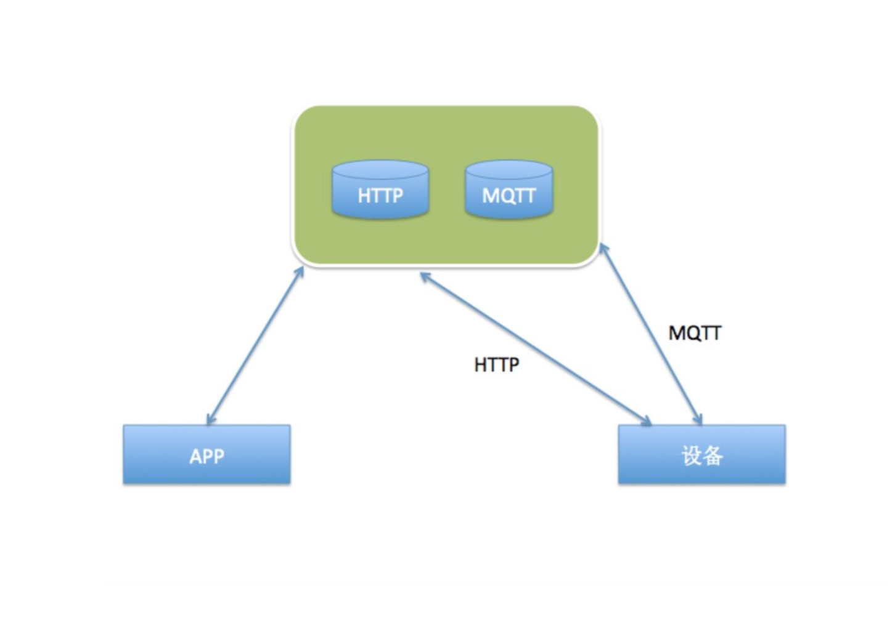

# 设备开发指导-MTK

DotlinkCloud不提供联网固件，提供了MTK的设备SDK。 硬件厂商可以集成SDK到联网固件（WIFI, GPRS）模块中，实现和云端连接。

* 云端控制台提供了数据点的定义，可以定义硬件的功能。
* 联网固件和云端按照数据点协议进行加密通信，而MCU通过串口和联网固件进行通信。
* 厂商只需要在MCU上开发自己的设备控制逻辑，不用开发相关的联网控制逻辑，所有的联网控制逻辑都由设备SDK来实现。
* 厂商只要按照协议要求，进行通信控制即可。


## 系统架构


## 集成到MTK环境
### 1. 在Option.Mak添加
```
ifdef USE_MQTT_TASK_SERVER
ifeq ($(strip $(USE_MQTT_TASK_SERVER)),TRUE)
   COM_DEFS    +=  __USE_MQTT_TASK_SERVER__ 
endif
endif
```

### 2. 在App_task_config.h添加

```
#ifdef __USE_MQTT_TASK_SERVER__
#define TASK_PRIORITY_MQTT          (KAL_PRIORITY_CLASS25+9)
#endif

```

```
#ifdef __USE_MQTT_TASK_SERVER__
task_index(INDX_MQTT)  
/*module_type and mod_task_g*/
task_module_map(INDX_MQTT, MOD_MQTT)
/*task's parameters*/
task_name("MQTT")
task_queue_name("MQTT Q")
task_priority(TASK_PRIORITY_MQTT)
task_stack_size(2048)
task_create_function(mqtt_create)
task_stack_internalRAM(KAL_FALSE)
task_external_queue_size(10)
task_internal_queue_size(0)
task_boot_mode(NORMAL_M)
#endif
```

### 3.添加mqtt_sap.h到user_msgid_app.h
```
#ifdef KAL_MSGID_EXPANSION
    #include "mqtt_sap.h"  
    MSG_ID_NAME(MQTT)
#else
    MODULE_MSGID_RANGE(MQTT, 10)
#endif
```

### 4. 放置mqtttask目录到plutommi目录下
  * mqtttask.c是task的入口

## 云端通信

### 1.设备接收
```

//从服务器接收到指令监听
void on_receive_msg(dlinkmq_datapoint *datapoint){
	printf("\n---------------on_receive_msg:");
	kal_prompt_trace(MOD_USB,"---on_receive_msg");

	//回复指令
	publish_msg();



	 // 操作串口

	//.......

	//如果需要回复到服务器确认，调用dlinkmq_publish
	// dlinkmq_publish


}
```

### 2.设备上报

```
void publish_msg(){
	dlinkmq_datapoint *datapoint=mqtt_med_malloc(50);
	dlinkmq_on_send fun_cb;
	
	fun_cb.on_send_msg=on_send_msg;

	datapoint->cmd_id=16;
	datapoint->msg_id=14;
	datapoint->cmd_value="213";
	datapoint->cmd_value_type=2;
	datapoint->cmd_value_len=3;

	//发送消息接口
	dlinkmq_publish(datapoint, PUBTOPIC, 1, fun_cb);
}
```
